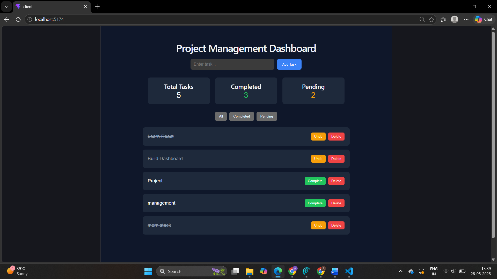

# Project Management Dashboard

A full-stack task management application built using React, Node.js, Express.js, and Axios.

## Features

- Create Tasks
- Delete Tasks
- Mark Tasks as Completed
- Dashboard Statistics
- Task Filtering (All, Completed, Pending)
- Responsive User Interface

## Frontend

- React
- Vite
- Axios

## Backend

- Node.js
- Express.js
- CORS

## Installation

### Client

```bash
cd client
npm install
npm run dev
```

### Server

```bash
cd server
npm install
node index.js
```

## Screenshot



## Internship Details

- Company: CodTech IT Solutions
- Domain: Full Stack Web Development
- Project: Project Management Dashboard
- Intern ID:CITS909
